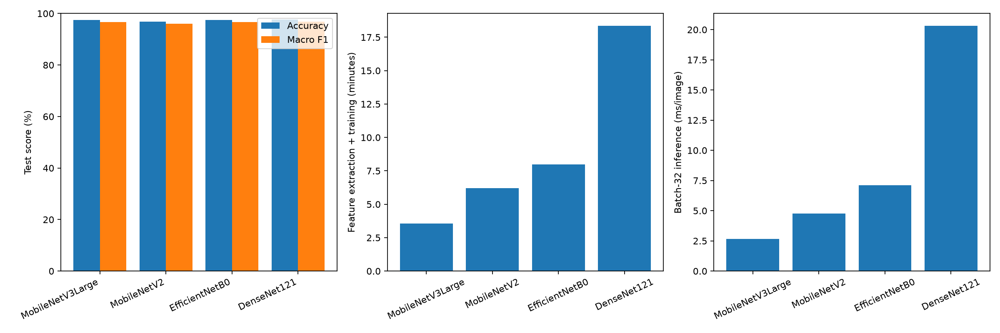

# Four-model comparison

Preferred model by validation macro F1: **MobileNetV3Large**.

All models use the same 38-class PlantVillage raw/color dataset and stratified image splits.
RGB images are resized to 128 × 128 for all models.
MobileNetV3Large replaces the original CNN baseline, which achieved 51.27% test accuracy. The historical baseline artifacts remain in OriginalCNN/.
The pretrained models use frozen ImageNet encoders and a Dense(256)/Dropout(0.3) classification head.
Maximum 30 epochs, Adam(0.001), inverse-frequency class weights, and identical early-stopping policies.

| Model | Test accuracy | Test macro F1 | Validation macro F1 | Training minutes | Batch-32 ms/image | Size MB |
|---|---:|---:|---:|---:|---:|---:|
| MobileNetV3Large | 97.50% | 96.74% | 96.84% | 3.55 | 2.66 | 13.70 |
| MobileNetV2 | 96.86% | 96.06% | 96.10% | 6.21 | 4.76 | 10.98 |
| EfficientNetB0 | 97.44% | 96.72% | 96.15% | 8.00 | 7.12 | 18.40 |
| DenseNet121 | 97.59% | 96.88% | 96.70% | 18.36 | 20.32 | 30.77 |

Training timings are from this CPU and include train/validation feature extraction plus fitting, excluding test extraction, weight downloads, and model construction. Inference timing excludes image decoding and resizing.
This is one seeded comparison at a common resolution, not a full fine-tuning or native-resolution benchmark.
The test split contains 8,129 images; scores describe held-out PlantVillage images, not field performance.
Model selection uses validation macro F1. Upload one image in the app to see predictions from all four current models together.
Saved split_manifest.csv fixes image membership and class order, and includes each image SHA256 for cache integrity.
